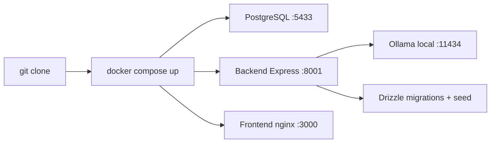
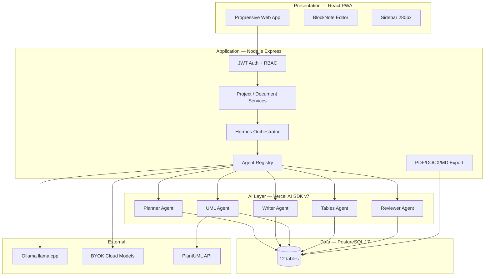
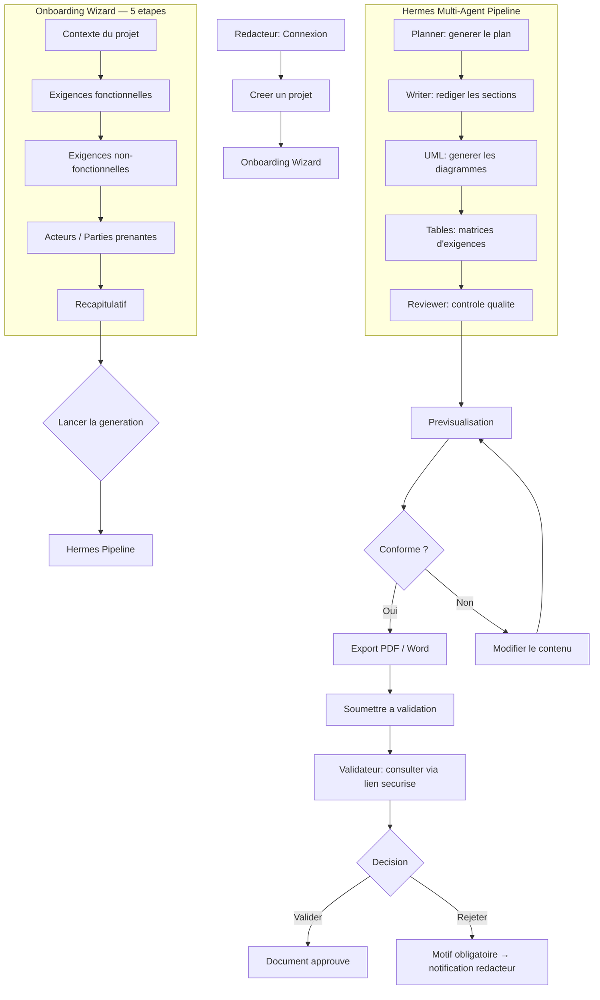
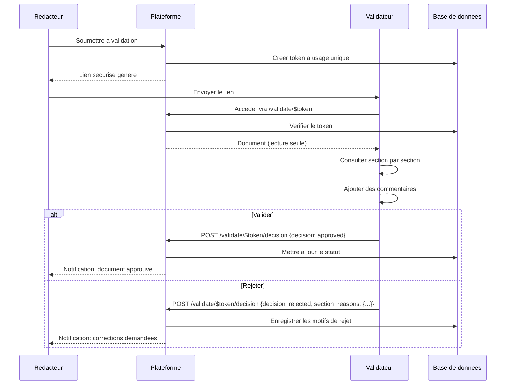
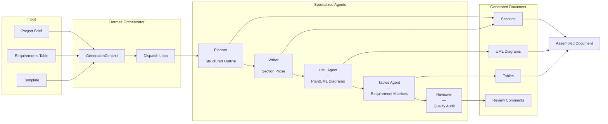
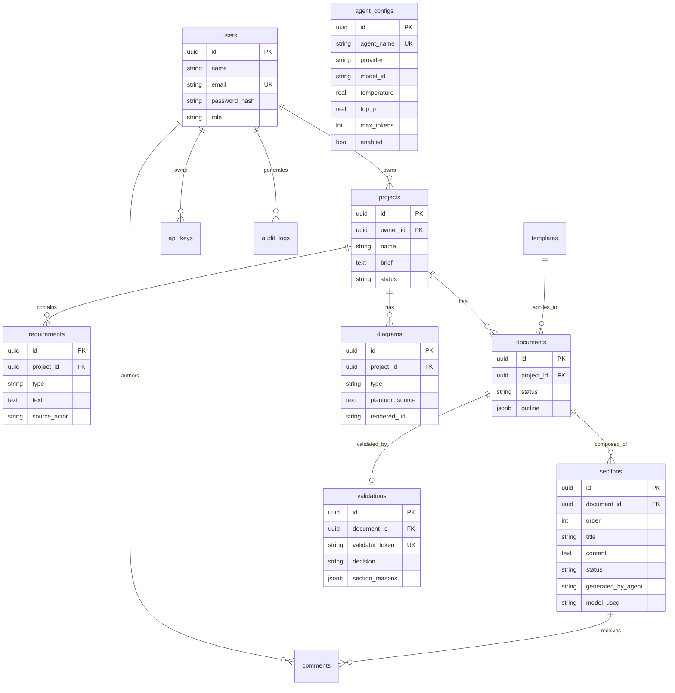
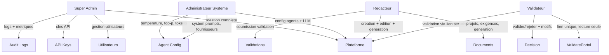

# Repora

> **Cahier des Charges intelligent** — plateforme PWA auto-hebergee de generation de specifications techniques par orchestration multi-agents IA.

Repora automatise la redaction, la structuration, la generation de diagrammes UML et la validation des cahiers des charges a partir des besoins exprimes en langage naturel. Une equipe d'agents IA specialises collabore pour produire un document professionnel complet — avec diagrammes UML, matrices d'exigences et controle qualite — dans un editeur collaboratif par blocs.

---

## Installation — Une commande

### Pre-requis

- **Docker Desktop** (Windows / Mac) ou **Docker Engine** (Linux)
- **Ollama** avec un modele installe (optionnel — BYOK cloud fonctionne independamment)

```bash
# 1. Installer Ollama et telecharger un modele (recommande)
ollama pull llama3.1:8b

# 2. Cloner et lancer Repora
git clone https://github.com/menoc61/repora-web.git repora-web
cd repora-web
docker compose up
```



**C'est tout.** Ouvrez [http://localhost:3000](http://localhost:3000). La base de donnees est automatiquement migree et peuplee avec des donnees de demo.

> **Linux** : si `host.docker.internal` ne fonctionne pas, creez un fichier `.env` avec `OLLAMA_HOST=172.17.0.1`.

### Comptes de demo

| Role | Email | Mot de passe |
|------|-------|-------------|
| Super Admin | `admin@repora.dev` | `admin123` |
| Redacteur | `jean@exemple.com` | `test123` |
| Redacteur | `marie@exemple.com` | `test123` |
| Validateur | `client@exemple.com` | `client123` |
| Admin | `sarah@repora.dev` | `test123` |

### Developpement local

```bash
# Backend
cd backend && npm install
npm run db:generate && npm run db:migrate && npm run db:seed
npm run dev                          # Express → http://localhost:8000

# Frontend
npm install && npm run dev           # Vite → http://localhost:5173
```

Creer `.env` : `VITE_API_BASE=http://localhost:8000`

---

## Architecture



---

## Workflow Utilisateur

### Flux principal : Creation d'un cahier des charges



### Flux de validation client



---

## Pipeline Agent Hermes



Chaque agent est **independant** : modele, temperature, token budget et fournisseur (local ou BYOK) configurables individuellement.

### Outils des agents (Tool Calling)

| Agent | Outils | Operation DB |
|-------|--------|-------------|
| **Planner** | `getProjectContext`, `getRequirements` | Lecture projets + exigences |
| **Writer** | `getProjectContext`, `writeSection` | Lecture projets + ecriture sections |
| **UML** | `getProjectContext`, `getDocumentContent`, `getRequirements`, `saveDiagram` | Lecture contexte + ecriture diagrammes |
| **Tables** | `getProjectContext`, `getDocumentContent`, `getRequirements`, `saveRequirementSection` | Lecture exigences + ecriture tableaux |
| **Reviewer** | `getProjectContext`, `getDocumentContent`, `flagIssue`, `suggestFix`, `approveSection`, `updateDocumentStatus` | Lecture document + ecriture commentaires/statuts |

---

## Modele de donnees



---

## Pages de l'application

| Route | Page | Description | Acces |
|-------|------|-------------|-------|
| `/workspace` | WorkspaceDashboard | Tableau de bord, creation de projet, activite | Auth |
| `/onboarding/$id` | OnboardingWizard | Assistant 5 etapes de collecte d'exigences | Auth |
| `/editor` | Editor | Editeur BlockNote collaboratif + streaming SSE agent | Auth |
| `/library` | DocumentLibrary | Liste, recherche et filtrage des documents | Auth |
| `/templates` | TemplateGallery | Navigation et selection de modeles | Auth |
| `/agents` | AgentWorkshop | Configuration et test des agents IA | Auth |
| `/analytics` | Analytics | Metriques, performances, monitoring | Auth |
| `/collaboration` | CollaborationHub | Presence en temps reel, equipe | Auth |
| `/export` | ExportPreview | Previsualisation et export PDF/DOCX | Auth |
| `/settings` | Settings | Profil, preferences, cles API | Auth |
| `/infrastructure` | Infrastructure | Sante systeme, GPU, services, logs | Auth |
| `/sharing` | Sharing | Partage de documents et gestion des acces | Auth |
| `/history` | VersionHistory | Historique des versions, comparaison, restauration | Auth |
| `/login` | LoginPage | Authentification | Public |
| `/signup` | SignupPage | Inscription | Public |
| `/validate/$token` | ValidatePortal | Portail de validation client (lien a usage unique) | Public |

---

## Acteurs et Roles



---

## Stack Technique

### Frontend

| Categorie | Technologie |
|-----------|------------|
| Framework | React 19 + TypeScript |
| Build | Vite 5 |
| Routing | TanStack Router |
| State | Zustand 5 (persist) + TanStack Query |
| Validation | Zod 4 |
| UI | shadcn v4 (@base-ui/react) + Tailwind CSS 3 |
| Editor | BlockNote + Yjs (WebSocket) |
| Icons | Material Symbols |
| Fonts | Geist (headings), Inter (body), JetBrains Mono (mono) |

### Backend

| Categorie | Technologie |
|-----------|------------|
| Runtime | Node.js 22 + Express 5 |
| ORM | Drizzle ORM + drizzle-kit |
| DB | PostgreSQL 17 |
| AI SDK | Vercel AI SDK v7 (provider-agnostic) |
| Auth | JWT (jsonwebtoken) + bcryptjs |
| Diagrams | PlantUML (zlib deflate + base64 encoding) |
| Export | pdf-lib + docx |
| Real-time | ws + y-websocket |

### Infrastructure

| Service | Technologie | Port |
|---------|------------|------|
| Frontend | nginx:alpine (SPA) | 3000:80 |
| Backend | Node 22 Alpine (tsx) | 8001:8000 |
| Database | postgres:17 | 5433:5432 |
| LLM Local | Ollama (host) | 11434 |

---

## Export

La plateforme prend en charge l'export aux formats suivants :

| Format | Endpoint | Usage |
|--------|----------|-------|
| **PDF** | `GET /documents/:id/export?format=pdf` | Document final, archivage |
| **DOCX** | `GET /documents/:id/export?format=docx` | Edition collaborative Word |
| **Markdown** | `GET /documents/:id/export?format=md` | Integration Git / CI |
| **PNG** | `GET /projects/diagrams/:id/export?format=png` | Diagrammes pour insertion rapport |
| **SVG** | `GET /projects/diagrams/:id/export?format=svg` | Diagrammes vectoriels |

---

## BYOK Cloud

Repora fonctionne avec Ollama en local **par defaut** (zero cout, confidentialite totale). Les modeles cloud sont disponibles en opt-in :

- OpenAI (GPT-4o, GPT-4o-mini)
- Anthropic (Claude Sonnet, Claude Haiku)
- Google (Gemini Pro, Gemini Flash)
- Tout endpoint compatible OpenAI (Groq, OpenRouter, etc.)

Les cles API sont chiffrees au repos (AES-256). Configuration par agent depuis la page Infrastructure.

---

## Tests

```bash
# Backend (integration tests require PostgreSQL)
cd backend && npm test

# Frontend (unit + component tests)
npm test

# Build verification
npm run build
```

---

## Structure du projet

```
repora-web/
├── src/                          # Frontend React (15 pages)
│   ├── api/client.ts             # HTTP + SSE client
│   ├── hooks/useQueries.ts       # 40+ TanStack Query hooks
│   ├── stores/index.ts           # Zustand (Auth, Workspace, Settings)
│   ├── schemas/index.ts          # Zod schemas + interfaces
│   ├── router.tsx                # TanStack Router (15 routes)
│   ├── layout/{Sidebar,TopBar}   # Shell layout
│   ├── pages/                    # 15 page components
│   │   ├── OnboardingWizard.tsx  # Requirements elicitation wizard
│   │   ├── ValidatePortal.tsx    # Public validator portal
│   │   └── ...                   # 13 other pages
│   └── components/               # UI primitives + shared components
├── backend/
│   ├── src/
│   │   ├── ai/                   # Hermes orchestrator + agents + tools
│   │   │   ├── hermes.ts         # Agent runner, SSE events, model discovery
│   │   │   ├── agents/           # 5 specialized agent definitions
│   │   │   ├── tools/            # 4 tool modules (document, diagram, review, tables)
│   │   │   ├── pipeline/         # Orchestration pipeline + negotiation
│   │   │   └── providers/        # LlamaCppProvider, BYOKProvider
│   │   ├── routes/               # 15 Express routers
│   │   ├── services/             # 14 business logic services
│   │   ├── db/schema.ts          # 12 table Drizzle definitions
│   │   ├── db/seed.ts            # Demo data seeder (French)
│   │   └── config.ts             # Environment configuration
│   ├── docker-entrypoint.sh      # Auto migration + seed on Docker start
│   └── Dockerfile                # Multi-stage Node 22 Alpine
├── docker-compose.yml            # 3 services (frontend, backend, db)
├── nginx.conf                    # SPA fallback + /api proxy
├── DESIGN.md                     # Visual design system (authoritative)
├── AGENTS.md                     # Build spec for autonomous agents
└── docs/class-diagram.puml       # Full class diagram (6 packages, 70+ classes)
```

---

## Conventions

- **Composants** : shadcn v4 primitives (`Button`, `Card`, `Badge`, `Table`, `Input`, `Select`)
- **Icones** : `<Icon name="..." />` via Material Symbols
- **Status** : `<StatusBadge status={'draft'|'review'|'final'|'active'|'autonomous'}>`
- **Navigation** : `<Link to="/path">` de `@tanstack/react-router`
- **Langue** : Interface et documents generes en francais
- **Design System** : `DESIGN.md` fait autorite pour toutes les decisions visuelles

---

## Contribution

1. Creer une branche depuis `master`
2. Suivre les conventions (stores/schemas/hooks, primitives shadcn, types OOP)
3. `npm run build` avant de push
4. Ouvrir une PR
